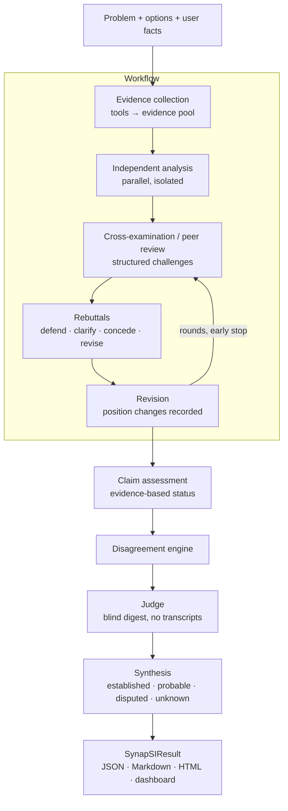
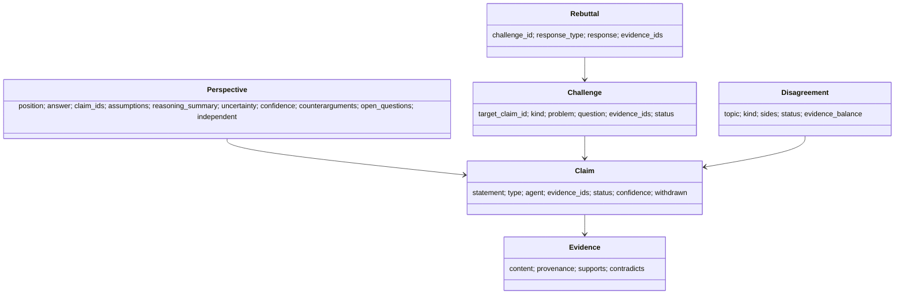

# SynapSI

**Synaptic Super Intelligence** — *many minds, one intelligence.*

An open-source framework for collective AI reasoning: multiple agents reason
independently, exchange structured claims and evidence, challenge one another,
make disagreement explicit, and synthesize a result — and an experiment engine
to measure whether any of that actually helps.

> SynapSI does **not** assume that more agents, more models, or more debate
> produce better answers. It is built so you can find out when they do, when
> they don't, and when they make things worse.

---

## Contents

1. [Why SynapSI](#why-synapsi) · 2. [Core philosophy](#core-philosophy) ·
3. [Architecture](#architecture) · 4. [Quickstart](#quickstart) ·
5. [Installation](#installation) · 6. [First example](#first-example) ·
7. [Agents](#agents) · 8. [Workflows and strategies](#workflows-and-strategies) ·
9. [Deliberation protocol](#deliberation-protocol) · 10. [Claims](#claims) ·
11. [Evidence](#evidence) · 12. [Tools](#tools) · 13. [Models](#models) ·
14. [Judge and synthesis](#judge-and-synthesis) · 15. [CLI](#cli) ·
16. [Web UI](#web-ui) · 17. [Experiments](#experiments) ·
18. [Custom agents](#custom-agents) · 19. [Custom workflows](#custom-workflows) ·
20. [Configuration](#configuration) · 21. [Cost, observability, memory](#cost-observability-memory) ·
22. [Research roadmap](#research-roadmap) · 23. [Limitations](#limitations) ·
24. [Contributing](#contributing)

## Why SynapSI

"Have five LLMs chat" is easy to build and hard to trust. Free-form multi-agent
transcripts hide what was claimed, on what basis, who disagreed, and whether
agreement came from evidence or from agents copying each other. They also
multiply cost without telling you whether accuracy improved.

SynapSI replaces transcripts with **structured, inspectable artifacts** and
pairs every deliberation strategy with **baselines and metrics**, so collective
reasoning becomes something you can measure rather than assume.

## Core philosophy

| Principle | What it means in practice |
| --- | --- |
| **Independence first** | Agents form positions before seeing anyone else's. Concurrent agents don't even see each other's tool results. |
| **Evidence over consensus** | Claim status comes from evidence and unresolved challenges — never from how many agents agree. |
| **Model output is not evidence** | Only tools, documents, databases, and the user create external evidence. "Studies show…" from a model is stored as unverified `model_knowledge`. |
| **Uncertainty is a valid answer** | Judges can return `inconclusive` or `split`; synthesis has an explicit **unknown** bucket. |
| **Disagreement is data** | Disagreements are objects with sides, claims, and evidence. Minority positions with strong evidence stay visible. |
| **No simple voting by default** | Voting exists as a *baseline*. The model judge never sees vote counts unless you ask. |
| **Inspectable, not introspective** | Agents return concise reasoning summaries and structured claims. Hidden chain-of-thought is never requested or shown. |
| **Measurable and reproducible** | Every run records models, prompt version, settings, seed, usage, cost, and latency. |

## Architecture



| Layer | Modules |
| --- | --- |
| Interfaces | `Council` (SDK), `synapsi` CLI, REST/WebSocket API, React dashboard |
| Orchestration | `workflows` (engine), `strategies`, `deliberation.steps` |
| Reasoning artifacts | `claims` (graph), `evidence` (pool), `deliberation.disagreement`, `judgment`, `synthesis` |
| Infrastructure | `agents`, `providers`, `tools`, `observability`, `memory`, `config` |
| Research | `experiments` (engine, suites, metrics) |

Details: [docs/architecture.md](docs/architecture.md),
[docs/protocol.md](docs/protocol.md), [docs/strategies.md](docs/strategies.md),
[docs/custom-workflows.md](docs/custom-workflows.md),
[docs/experiments.md](docs/experiments.md).

## Quickstart

```bash
pip install "synapsi[server] @ git+https://github.com/Yashjindal11/synapsi"
synapsi init                         # writes synapsi.yaml and .env.example
export OPENAI_API_KEY=...            # or use ollama:<model> locally, no key
synapsi run "Should we migrate our job queue to Kafka?" \
    --option yes --option no --model openai:gpt-4o-mini --strategy debate
```

Without `--model` or a config, SynapSI uses the **mock provider**: it runs the
whole pipeline offline with placeholder text. Useful for exploring the data
structures; meaningless as reasoning.

## Installation

Python 3.11+.

```bash
pip install "synapsi @ git+https://github.com/Yashjindal11/synapsi"            # library + CLI
pip install "synapsi[server] @ git+https://github.com/Yashjindal11/synapsi"    # + web API
```

From source (development): see [CONTRIBUTING.md](CONTRIBUTING.md).

Core dependencies are deliberately small: `pydantic`, `httpx`, `pyyaml`.
Providers are plain HTTP adapters — no vendor SDKs required.

## First example

```python
import asyncio
from synapsi import Agent, Council

async def main():
    model = "openai:gpt-4o-mini"          # or "anthropic:...", "gemini:...", "ollama:llama3.1"
    council = Council(
        [
            Agent.from_role("researcher", model),
            Agent.from_role("statistician", model),
            Agent.from_role("skeptic", model),
        ],
        strategy="debate",
        mode="balanced",
        seed=42,
    )
    result = await council.run(
        "Did the four-day week cause the productivity increase?",
        options=["yes", "no", "cannot be determined"],
        facts=["Output per employee rose 8% during the pilot.",
               "A new CRM was rolled out the same quarter."],
    )
    print(result.judgment.verdict, result.answer)
    print(result.synthesis.summary)
    for finding in result.synthesis.disputed:
        print("disputed:", finding.statement)
    result.save("run.json")               # JSON; also .to_markdown(), .to_html()

asyncio.run(main())
```

More in [examples/](examples): decision analysis, data science with SQL,
ML model review, architecture review, document research, business jury,
aviation operations on synthetic data, multi-model councils, custom agents,
custom workflows, web research, adversarial debate, and an experiment.

## Agents

An `Agent` has a name, role, model, instructions, tools, and a level (for
hierarchical review). Each protocol task is a separate async method —
`analyze`, `challenge`, `review`, `respond`, `revise` — so you can override one
behaviour without touching the rest, or replace the model entirely with code.

Built-in roles (`synapsi agents`): `analyst`, `researcher`, `data_scientist`,
`statistician`, `software_engineer`, `domain_expert`, `skeptic`,
`devils_advocate`, `fact_checker`, `risk_analyst`, `judge`, `synthesizer`.
Any other string becomes a free-form expertise (`Agent.from_role("aviation_economist", ...)`),
and `register_role(RoleSpec(...))` adds reusable ones.

```python
Agent("Platform Engineer", "software_engineer", "anthropic:<model>",
      instructions="Prioritise operability and failure isolation.",
      tools=[calculator_tool()], temperature=0.5)
```

## Workflows and strategies

Strategies are ordinary workflows built from public steps
(`synapsi workflows`):

| Strategy | Shape | Use it to test |
| --- | --- | --- |
| `single_model` | one agent | the baseline everything must beat |
| `majority_vote` | independent answers → plurality | self-consistency style aggregation |
| `independent_panel` | independent answers → judge | value of independent samples |
| `peer_review` | blind review → respond → private revision | whether critique helps |
| `debate` | rounds of challenge → respond → revise | iterative argument |
| `adversarial` | steelman the alternative → adversarial rounds | pressure on the leading answer |
| `jury` | collect evidence → argue → judge decides | judge-centred decisions |
| `evidence_first` | research → analyze → verify claims → review | grounding before reasoning |
| `hierarchical` | analysts reviewed by level-2 reviewers | separating roles |
| `sequential_critique` | each agent improves the last | chained refinement |

**Modes** set parameters, never agent counts:

| Mode | Rounds | Challenges/agent | Claim verification |
| --- | --- | --- | --- |
| `fast` | 1 | 2 | off |
| `balanced` | 2 | 3 | off |
| `deep` | 3 | 4 | on |

`Council.preset("fast" | "balanced" | "deep", model)` gives a 3 / 5 / 8-role
panel if you want a starting point.

## Deliberation protocol

Agents exchange validated objects, not paragraphs:



Cross-examination is structural. Instead of "I disagree":

```text
X4  Skeptic → C2 (Statistician)  [evidence, open]
    problem : the cited data only shows correlation
    question: what supports a causal interpretation?
R2  → X4  [revise] claim narrowed to association; C2 withdrawn, C9 refines it
```

A defence **without** evidence leaves the challenge open — assertion is not
resolution. Concessions and revisions change claim status.

Groupthink countermeasures built in: independent first pass with evidence
snapshots, blind and shuffled review (`Analyst 1..n`), seeded random ordering,
adversarial/contrarian roles, judge isolation (structured digest, no
transcripts, no vote counts), source-dependence tracking, and position-change
records that flag changes made **without** new evidence or a concession.

## Claims

The `ClaimGraph` stores claims (`C1, C2, …`) and typed relations (`supports`,
`contradicts`, `refines`). Status is computed deterministically:

| Condition | Status |
| --- | --- |
| contradicting external evidence, no external support | `contradicted` |
| external support + contradiction or open challenge | `partially_supported` |
| external support, unchallenged | `supported` |
| only model-knowledge support | `unverified` |
| challenged, no external support | `uncertain` |
| no evidence | `unsupported` |

Five agents asserting the same thing with no evidence leaves it `unsupported`.
A judge may adjust statuses but cannot mark a claim supported without external
evidence.

## Evidence

Every item carries provenance: source kind (`user_provided`, `document`, `web`,
`database`, `api`, `calculation`, `experiment`, `tool`, `model_knowledge`),
source id/URL, tool, query, producing agent, timestamp. Agents cite evidence by
id; unknown ids are dropped and counted (a hallucinated-citation metric).
`result.uncertainty.source_dependence` reports when apparent agreement rests on
the **same** underlying source.

## Tools

```python
from synapsi.tools import (calculator_tool, document_search_tool, DocumentStore,
                           sql_tool, web_search_tool, TavilySearch, fetch_url_tool, tool)

@tool(description="Look up current fleet size")
def fleet_size(airline: str) -> str: ...
```

Built-ins: safe AST calculator (with statistics functions), BM25 document
search, read-only SQLite, web search (Tavily, Brave, or an offline static
corpus), and URL fetching that refuses private addresses. Every tool result
becomes evidence. There is intentionally no built-in code-execution tool;
register your own sandboxed one if you need it.

## Models

```text
openai:gpt-4o-mini                     OPENAI_API_KEY
anthropic:<model>                      ANTHROPIC_API_KEY
gemini:<model>                         GEMINI_API_KEY
ollama:llama3.1:8b                     local, no key
huggingface:<org/model>                HF_TOKEN
openai-compatible:<model> + base_url   vLLM, LM Studio, Together, Groq, ...
mock                                   offline placeholders
```

Different agents can use different models; the judge can use yet another.
Structured output is requested via JSON mode where supported and validated with
Pydantic, with one automatic repair attempt. Add a provider by subclassing
`ModelProvider` and calling `register_provider`.

## Judge and synthesis

- **`Judge`** (model): sees a transcript-free digest — positions, claims with
  status, evidence, challenges/responses, unresolved disagreements — with agent
  identities hidden and vote counts withheld. Returns decision, verdict
  (`decided | inconclusive | split`), supporting/contradicting claims, evidence
  strength (capped when no external evidence exists), unresolved issues,
  minority positions.
- **`StructuralJudge`**: deterministic, no model call; prefers the answer whose
  claims carry the most external, unchallenged support and declares
  `inconclusive` otherwise. Use `judge="structural"`.
- **Synthesizer**: buckets claims by status into **established**,
  **probable**, **disputed**, **unknown**, plus recommendations drawn from open
  challenges and questions. An optional model only *writes the summary*; it
  cannot move claims between buckets.

If a model judge or synthesizer fails (or the budget runs out), SynapSI falls
back to the structural versions and records the error.

## CLI

```text
synapsi init                     starter synapsi.yaml + .env.example
synapsi run "question" [...]     deliberate (alias: deliberate)
    --strategy debate --mode deep --option A --option B
    --fact "..." --fact @data.txt --context @brief.md
    --format summary|md|json|html -o out.html --save-dir runs
synapsi inspect run.json --section claims|evidence|perspectives|challenges|disagreements|uncertainty|usage
synapsi report run.json -f html -o report.html
synapsi providers                providers and whether their key env var is set
synapsi workflows | agents       built-in strategies | roles
synapsi evaluate problems.jsonl --strategies single_model,debate --repeats 3 --out results/
synapsi benchmark --suite base_rates -n 30 --model ollama:llama3.1 --out results/
synapsi serve                    API + dashboard on http://127.0.0.1:8000
```

## Web UI

```bash
pip install "synapsi[server]"
(cd web/frontend && npm install && npm run build)
synapsi serve
```

Tabs: **Overview** (synthesis buckets), **Agents** (every perspective,
independent and revised, adversarial ones marked), **Claim graph** (evidence →
claims, relations, challenge edges, status colours; click to inspect),
**Claims**, **Evidence** (provenance; model knowledge dimmed), **Debate**
(challenge/response threads, position changes flagged when unsupported),
**Disagreement**, **Judge**, **Metadata** (usage per agent, settings,
uncertainty signals). Runs stream live over WebSocket. You can also open any
saved `run.json` without a server.

## Experiments

```python
from synapsi import Agent
from synapsi.experiments import Experiment
from synapsi.experiments.suites import base_rates

exp = Experiment(
    base_rates(n=30, seed=0),
    ["single_model", "majority_vote", "independent_panel", "debate", "adversarial"],
    agents=lambda: [Agent.from_role(r, "ollama:llama3.1") for r in ("analyst", "statistician", "skeptic")],
    repeats=3, seed=0,
)
result = await exp.run()
print(result.to_markdown()); result.save("results/base-rates")
```

Per strategy: accuracy with Wilson 95% CI, **coverage** (abstentions are not
hidden), selective accuracy, Brier score and ECE, **right→wrong / wrong→right
flips** relative to the initial independent majority (does deliberation fix or
break answers?), whether initial disagreement predicts errors (AUROC), calls,
tokens, cost, latency — plus exact McNemar tests against the baseline.
Councils can also be passed as a `{label: factory}` mapping to compare agent
counts, model mixes, blind vs. non-blind review, or judge types.

Built-in synthetic suites with computed gold answers: `arithmetic`,
`ordering`, `base_rates`, `aviation_delays`. Bring your own as JSONL
(`{"question", "options", "answer", "facts"}`) with `synapsi evaluate`.
Guide: [docs/experiments.md](docs/experiments.md).

**No benchmark results are published here yet.** Any numbers added to this
repository must come from saved experiment output with its configuration.

## Custom agents

```python
from synapsi import Agent
from synapsi.agents.drafts import PerspectiveDraft

class EconomistAgent(Agent):
    def system_prompt(self) -> str:
        return super().system_prompt() + "\nAlways state one testable prediction."

class RuleBasedAgent(Agent):
    async def analyze(self, ctx, **_) -> PerspectiveDraft:
        ...  # compute an answer in code; add calculation evidence via ctx.add_evidence
```

See [examples/09_custom_agent.py](examples/09_custom_agent.py) for a
model-free agent that participates in debate alongside LLM agents.

## Custom workflows

```python
from synapsi import Council, Workflow
from synapsi.workflows import Loop
from synapsi.deliberation.steps import (IndependentAnalysis, CrossExamination,
                                        RespondToChallenges, Revision, converged)
from synapsi.strategies import finalize

workflow = Workflow(
    [
        IndependentAnalysis(),
        MyStopIfUnanimous(),                       # any Step subclass; raise StopWorkflow to end early
        Loop([CrossExamination(), RespondToChallenges(), Revision()],
             max_iterations=3, until=converged),
    ],
    finalize=finalize(),                           # claim status, disagreements, judge, synthesis
)
council = Council(agents, strategy=workflow)
```

Steps share a `RunContext` (problem, agents, state, events, usage, seeded
RNG). `Parallel`, `Conditional`, `FunctionStep`, `stop_when`, and `Budget`
cover most control flow without a DSL. Guide:
[docs/custom-workflows.md](docs/custom-workflows.md).

## Configuration

```yaml
models:
  default: {spec: "openai:gpt-4o-mini", price_per_mtok: [0.15, 0.60]}
  local:   {spec: "ollama:llama3.1"}
agents:
  - {role: researcher,   model: default, tools: [web_search]}
  - {role: statistician, model: local,   tools: [calculator]}
  - {role: skeptic,      model: default}
judge:       {kind: model, model: local, blind: true, show_votes: false}
workflow:    {strategy: adversarial, mode: balanced, seed: 42}
tools:       {web_search: {backend: tavily}}
budget:      {max_cost_usd: 0.50, max_model_calls: 150}
memory:      {enabled: false}
```

YAML, TOML, or JSON. Unknown keys are rejected, and API keys can only come
from environment variables (`api_key_env`). Prices in examples are
placeholders — use your provider's current rates.

## Cost, observability, memory

- **Cost/latency**: concurrent agents, per-provider rate limits, retries with
  backoff, caching for deterministic calls, token and cost tracking (prices
  are **yours** — SynapSI ships none), early stopping, and hard budgets that
  stop gracefully and still produce a structural judgment and synthesis.
- **Observability**: structured events for every step, agent, model call,
  tool call, claim, evidence item, challenge, rebuttal, position change,
  disagreement, judgment, and synthesis. Subscribe with `event_handlers=[...]`
  or write JSONL traces with `trace_dir`.
- **Memory**: off by default. When enabled, stores only question, answer,
  verdict, and summary; recalled items are shown to agents as *prior
  conclusions, not evidence*.

## Research roadmap

SynapSI is designed to make these questions answerable with reproducible
experiments. None of them is answered yet.

| Question | How to study it with SynapSI |
| --- | --- |
| How many agents are useful? | `Experiment` with councils of 1, 3, 5, 8 agents |
| Does model diversity help? | same roles, same-model vs. mixed-model councils |
| Does role diversity help? | identical analysts vs. specialised roles |
| How many debate rounds? | `rounds` 1–4, `early_stop` on/off; track flips |
| Does independence reduce groupthink? | `sequential_critique` vs. `independent_panel`; unsupported position changes |
| Does evidence-first help? | `evidence_first` vs. `debate` with the same tools |
| Which judge works best? | model vs. structural vs. vote; blind vs. `show_votes=True` |
| Does disagreement predict error? | `disagreement_error_auroc` |
| When is extra reasoning not worth it? | accuracy deltas vs. tokens/cost |
| When does deliberation make answers worse? | right→wrong flips |

Planned: native provider tool-calling, streaming deliberation in the
dashboard, claim de-duplication across agents with embeddings, more suites
with external datasets (with licences), and published, reproducible results.

## Limitations

- Status rules are only as good as the evidence links agents and verifiers
  produce; an agent can cite real evidence for a claim it doesn't support.
  Verification (`deep` mode) helps but uses models too.
- The structural judge is a heuristic; it credits an answer with the evidence
  behind its claims without checking that the claims entail the answer.
- Retrieved documents can contain prompt injection. Evidence is labelled but
  models may still be influenced.
- Model-reported confidence is not calibrated; calibration metrics exist to
  measure exactly that.
- Multi-agent runs cost several times more than a single call. Measure before
  adopting.

## Contributing

See [CONTRIBUTING.md](CONTRIBUTING.md). Negative results are as welcome as
positive ones. Security issues: [SECURITY.md](SECURITY.md).

## License

[MIT](LICENSE)
