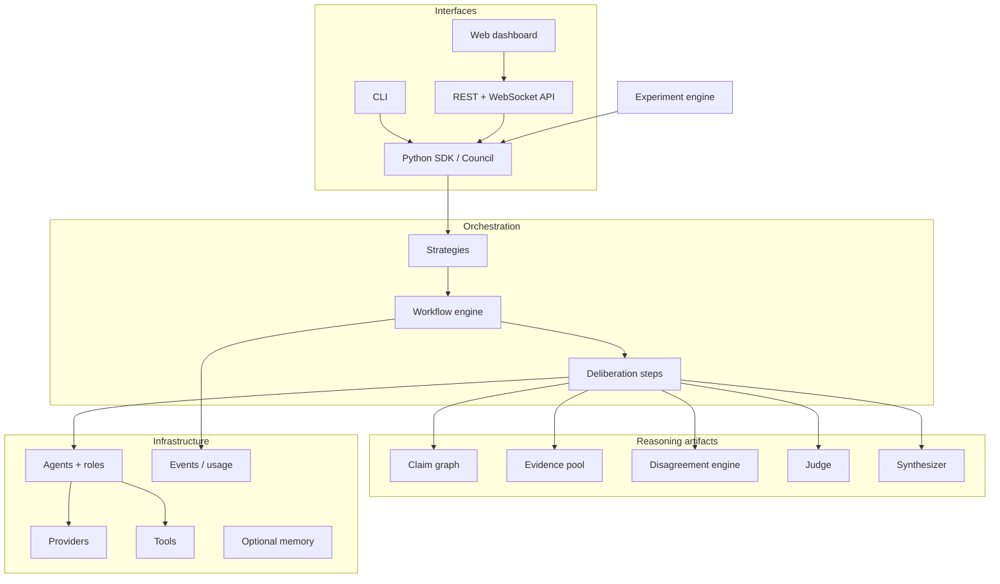
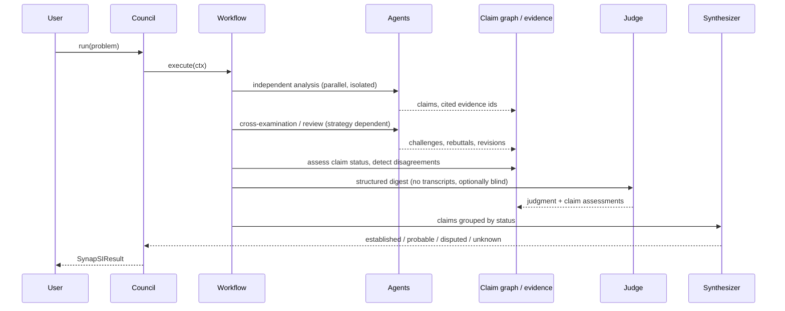

# SynapSI Architecture

SynapSI is infrastructure for **studying** collective machine reasoning, not a
claim that it works. Every design decision below serves one question:

> When does structured multi-agent deliberation produce better outcomes than a
> single model, and when does it make things worse?

## Design principles

| Principle | Consequence in the code |
| --- | --- |
| Independence first | Agents form a position before seeing anyone else's. Steps that expose other perspectives say so explicitly and mark the resulting perspective `independent=False`. |
| Evidence over consensus | Claim status is derived from evidence and unresolved challenges, never from how many agents agree. |
| Model output is not evidence | Anything an LLM asserts is stored as `model_knowledge`. Only tools, documents, and user input create external evidence. |
| Uncertainty is a valid answer | Judges can return `inconclusive` or `split`; synthesis has an explicit `unknown` bucket. |
| Disagreement is data | Disagreements are first-class objects with sides, claims, and evidence. Minority positions are preserved. |
| Provider independence | The core depends on a small `ModelProvider` interface; vendors are adapters. |
| Workflow independence | Strategies are ordinary workflows composed from public steps. Nothing in the engine assumes debate. |
| Measurable | Every run records usage, cost, latency, configuration, and seed so strategies can be compared. |
| Inspectable, not introspective | Agents return concise reasoning summaries and structured artifacts. Hidden chain-of-thought is never requested or displayed. |

## Layers

## Core abstractions

- **`ModelProvider`** – `complete(request) -> Completion`. Adapters for OpenAI,
  Anthropic, Gemini, Ollama, Hugging Face, any OpenAI-compatible server, and a
  deterministic mock. Wrappers add retries, rate limiting, and caching.
- **`Agent`** – identity, role, instructions, model, tools, level. Exposes one
  async method per protocol task (`analyze`, `review`, `challenge`, `respond`,
  `revise`). Subclasses may override any of them, including with non-LLM logic.
- **`Step`** – `async run(ctx)`. Composable via `Sequential`, `Parallel`,
  `Loop`, `Conditional`, `FunctionStep`.
- **`Workflow`** – ordered steps plus stopping conditions and budget limits.
- **`RunContext`** – the shared state of one deliberation: problem, agents,
  `DeliberationState`, event bus, usage tracker, seeded RNG, settings.
- **`Council`** – the high-level entry point: agents + strategy + judge +
  synthesizer → `SynapSIResult`.
- **`Experiment`** – runs several councils/strategies over a problem set and
  computes accuracy, calibration, cost, latency, and paired comparisons.

## Run lifecycle

See [protocol.md](protocol.md) for the message schemas and
[strategies.md](strategies.md) for the built-in workflows.
